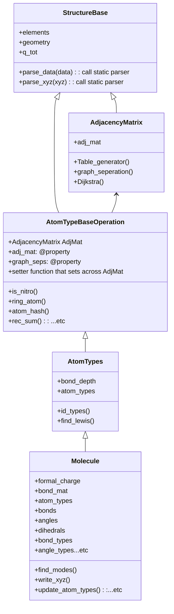

# TAFFI - Topology Automated Force Field Interactions
### Welcome to Lin's repo! 
### Unfortunately, all the work I've done as a software developer (not as a researcher) is all under copyright and cannot be shared publicly. 
### This repo is my *ongoing* effort (a lot more unit tests to be added!) to refactor the research code I wrote to have a better data structure and for me and my PhD advisor to release this in the future for free.
- ### For example driver script to see my coding style, see: driver_example.py
- ### For the theory behind this force field framework that we developed, see: https://doi.org/10.1021/acs.jcim.1c00491
- ### If you use any part of the code, please be courteous and cite the paper above!
- ### The data structure hierarchy:

